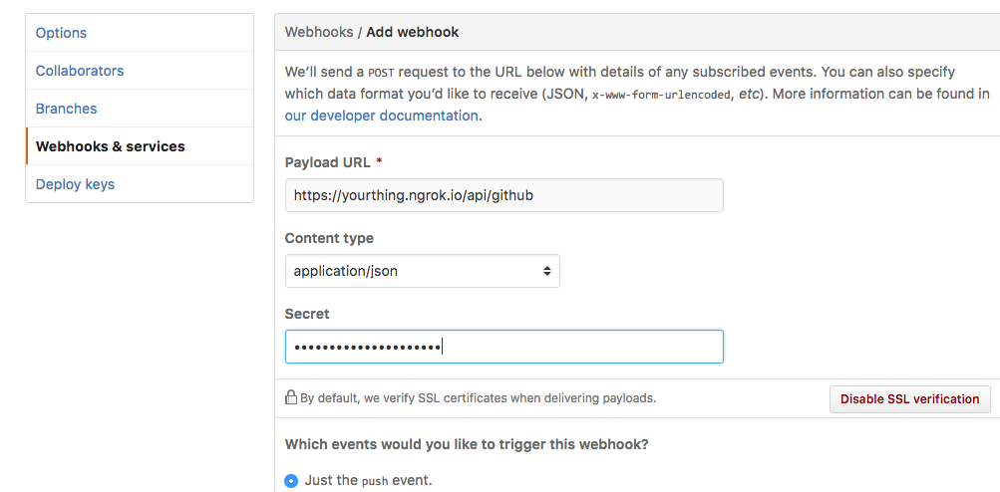
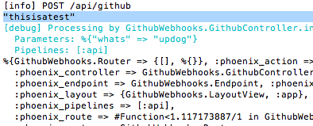

# Validating GitHub Webhooks with phoenix
## TL;DR

 * GitHub hashes the raw body of their messages
 * You need to implement a custom parser to calculate the hash and still parse the JSON.
 * Attempting to to implement a plug that reads the body before the parser renders the parsers unworkable. The body is read-once.
 * Use a secure comparison to mitigate timing attacks.
 * This repo is an example of how to do it in Phoenix.

## What are we going to do?

GitHub web hooks are a pretty cool way to monitor what is going on with
your code on GitHub. Want to take some automated action when someone pushes
to the master branch? Webhooks are very useful for that. However,
you don't want your application to act on just any POST request that comes in.
You need to be sure that the data your app is receiving really came from GitHub.

GitHub provides this assurance by signing the messages that it sends to you.
When you go into settings and set up a web hook you have the option of specifying
a key. GitHub will use that key to create a cryptographic hash of every message it
sends to you. When you receive a message you can calculate the hash yourself and
compare it to the hash GitHub provided thus proving that the message was sent by
some service that knows the key.

There are some challenges we need to get past, though. The biggest one is that you
have to read the body of the incoming request in its original form, in other words before
any parsers have had a chance to alter it. However, reading the body makes the body
inaccessible to anything else that needs to read the message body. So we can't just
make a simple function, we need to replace the JSON parser with a new parser that will
also create a copy of the unaltered body and put that in the `conn`. Let's get started.

## Create project and add dependencies

`mix phoenix.new github_webhooks --no-html --no-brunch`

Add this to `mix.exs` in the `defp deps do` block. When we compare the hash value provided by GitHub to the
hash value that we calculate we want to make sure that we're not opening ourselves up
to [timing attacks](https://codahale.com/a-lesson-in-timing-attacks/). So we need to do
a secure comparison instead of a simple `==`.

`{:secure_compare, "~> 0.0.1"},`

and run `mix deps.get`

## Create an endpoint for the webhooks.
We need a controller and a route. Since we're not going to tie this to a model
for this example, we'll just create the file manually instead of using the generator.
So make a file called `web/controllers/github_controller.ex` and populate it like this:

```
defmodule GithubWebhooks.GithubController do
  use GithubWebhooks.Web, :controller
  require Logger

  def index(conn, params) do
    IO.inspect conn.private
    IO.inspect params
    text conn, "thanks, GitHub"
  end

end
```

Then go over to `web/router.ex` and add a line for our new controller in the `api` scope:

`post "/github", GithubController, :index`

Test this out by running `mix phoenix.routes`. This may trigger a compile if you've been following
along and haven't already compiled once. You should see one entry in the route table, and that will
point to our new controller. At this point we can also fire up the web server and see the endpoint in
action, but if you're going to do that you'll need to run `mix ecto.create` since Phoenix requires
a database to run. If you've done that, then you can run `mix phoenix.server` to start the server and
then run `curl -H "Content-Type: application/json" -X POST -d '{"whats": "updog"}' http://localhost:4000/api/github`.
You should see _thanks, GitHub_ in the output.

And in the window where your server is running you'll see something like this:

```
%{GithubWebhooks.Router => {[], %{}}, :phoenix_action => :index,
  :phoenix_controller => GithubWebhooks.GithubController,
  :phoenix_endpoint => GithubWebhooks.Endpoint, :phoenix_format => "json",
  :phoenix_layout => {GithubWebhooks.LayoutView, :app},
  :phoenix_pipelines => [:api],
  :phoenix_route => #Function<1.41475838/1 in GithubWebhooks.Router.match_route/4>,
  :phoenix_router => GithubWebhooks.Router,
  :phoenix_view => GithubWebhooks.GithubView,
  :plug_session_fetch => #Function<1.74176132/1 in Plug.Session.fetch_session/1>}
%{"whats" => "updog"}
```

That last line is the params that were sent and the stuff above it is the content
of `conn.private` which is mostly reserved for framework-specific stuff. But hey, we
sent JSON to the server, how did the params (`%{"whats" => "updog"}`) become a map?
Well that's the work of the parsers. Have a look at `lib/github_webhooks/endpoint.ex`.
This is a bunch of plugs that are going to be run against every request that comes
into your Phoenix app **before** the router gets it. In there you'll find this
block of code:

```
plug Plug.Parsers,
  parsers: [:urlencoded, :multipart, :json],
  pass: ["*/*"],
  json_decoder: Poison
```

So every connection to your Phoenix app is going to pass through the `urlencoded` parser,
the `multipart` parser, and the `json` parser before it even gets to your router. Notice
the last line of the `endpoint.ex` file is `plug GithubWebhooks.Router`, your router.

## Open a network connection
For testing purposes, I'm going to use `ngrok` to open up port 4000 on my laptop to
the Internet. Make sure you've got the latest version of `ngrok` and then run `ngrok http 4000`. That
will give you a url that anyone can use to connect to your web app.

## Create a webhook
Pick one of your GitHub repos that you don't mind making a bunch of updates to
while you're working out the bugs. Set up a webhook that points to the url provided
by `ngrok`. Don't forget to include the `/api/github` if you've been following
along with me.


## Create a plug to get the signature
When GitHub sends the message to your web server, it will put a hashed value of the message in a request header. Phoenix helpfully lowercases these headers so we will need to extract the hash value from a field named `x-hub-signature`. That field will contain something like `sha1=d7d5e4cf9972a0b08b7a7ceb2d5db692c3ebe511`. Let's put the logic for grabbing that into a plug. Create a file named `/lib/github_webhooks/github_validator.ex` and fill it in with this.

```
defmodule GithubWebhooks.GithubValidiator do
  import Plug.Conn

  def init(options), do: options
  def call(conn, options) do
    validate_github(conn, options)
    conn
  end

  def validate_github(conn, _options) do
   IO.inspect get_signature(conn)
  end

  def get_signature(conn) do
    case get_req_header(conn, "x-hub-signature") do
      ["sha1=" <> signature] -> signature
      _ -> "no signature"
    end
  end
end
```

Then in your `web/router.ex` file, let's modify the :api pipeline so that our plug gets run every time.

```
pipeline :api do
  plug :accepts, ["json"]
  plug GithubWebhooks.GithubValidiator
end
```

Now when you run `curl -H "X-Hub-Signature: sha1=thisisatest" -H "Content-Type: application/json" -X POST -d '{"whats": "updog"}' http://localhost:4000/api/github` you'll see `thanks, GitHub` in the curl window and amongst the output in the server's window you'll see "thisisatest."



And if you want, you can make a simple change to the git repo where you set up the web hook and see that you get a hash delivered with the payload from GitHub too.

## Saving the body
Here's where things get a bit harder. It would be tempting to just
calculate the sha1 of `params` and compare the two. But the JSON parser actually changed the body that was sent by GitHub to make the `params.` So instead, we have to get to it first. We're going to make our own JSON parser.

To start, `touch lib/json_parser.ex` to create an empty file. Then go into `deps/plug/lib/plug/parsers/json.ex` and copy everything into `lib/json_parser.` We're going to make a couple simple changes to this file.

First, change the name of the module by making the top line read `defmodule GithubWebhooks.JSONParser do`.

Then change the functions that have access to the raw body so that they include that in the private part of the conn using the `put_private`
function. In cases where nothing was sent, I set `:raw_body` to an empty string. Like this:

```
def parse(conn, _type, _subtype, _headers, _opts) do
  {:next, put_private(conn, :raw_body, "")}
end
```

And then change all of the `decode` functions in the same way. Here is my finished `json_parser.ex` file.

```
defmodule GithubWebhooks.JSONParser do
  @moduledoc """
  Parses JSON request body.

  JSON arrays are parsed into a `"_json"` key to allow
  proper param merging.

  An empty request body is parsed as an empty map.
  """

  @behaviour Plug.Parsers
  import Plug.Conn

  def parse(conn, "application", subtype, _headers, opts) do
    if subtype == "json" || String.ends_with?(subtype, "+json") do
      decoder = Keyword.get(opts, :json_decoder) ||
                  raise ArgumentError, "JSON parser expects a :json_decoder option"
      conn
      |> read_body(opts)
      |> decode(decoder)
    else
      {:next, conn}
    end
  end

  def parse(conn, _type, _subtype, _headers, _opts) do
    {:next, put_private(conn, :raw_body, "")}
  end

  defp decode({:more, _, conn}, _decoder) do
    {:error, :too_large, put_private(conn, :raw_body, "")}
  end

  defp decode({:ok, "", conn}, _decoder) do
    {:ok, %{}, put_private(conn, :raw_body, "")}
  end

  defp decode({:ok, body, conn}, decoder) do
    case decoder.decode!(body) do
      terms when is_map(terms) ->
        {:ok, terms, put_private(conn, :raw_body, body)}
      terms ->
        {:ok, %{"_json" => terms}, put_private(conn, :raw_body, body)}
    end
  rescue
    e -> raise Plug.Parsers.ParseError, exception: e
  end
end
```

Now that we have a new JSON parser, let's replace the JSON parser in `endpoint.ex` with the one we've written.

```
plug Plug.Parsers,
  parsers: [:urlencoded, :multipart, GithubWebhooks.JSONParser],
```

We're getting close! Run the web server again (`mix phoenix.server`) and make a change to the GitHub repo where you set up the webhook. Now in the window where the server is running you'll see the POST request come in:

`[info] POST /api/github`

Followed by the hash that we extracted from the headers (yours will be different)

`e3cf7b8affad77adb31ebd395bc60b3507889c1e`

Then a debug message telling us which controller is processing the message

`[debug] Processing by GithubWebhooks.GithubController.index/2`

And the the contents of `conn.private` because our index action says `IO.inspect conn.private`. One of the fields in `conn.private` will be `raw_body` and it will have the unaltered, unparsed JSON that was sent from GitHub. Boo ya!

## Hash the raw body
We need to generate a cryptographic hash of the raw body that we captured and we need to include the secret value that we gave to GitHub when we set up the web hook. The best way to pass secrets into our application is to use environment variables, which is what we're going to do here. Let's open up `config/config.exs` and add this line:

```
# Shared secret with github
config :github_webhooks, :github_secret, System.get_env("GITHUB_WEBHOOK_SECRET")
```

Let's head back over to `github_validator.ex` and make some changes to the `validate_github` function.

```
def validate_github(conn, _options) do
 key = Application.get_env(:github_webhooks, :github_secret)
 body = conn.private.raw_body
 signature = get_signature(conn)
 hmac = :crypto.hmac(:sha, key, body) |> Base.encode16(case: :lower)

 case SecureCompare.compare(hmac, signature) do
   true -> IO.puts "Good signature from GitHub"
    conn
   _ -> IO.puts "Signature check failed"
    conn
    |> send_resp(401, "Not Authorized")
    |> halt
 end
end
```

Now if you run that same `curl -H "X-Hub-Signature: sha1=thisisatest" -H "Content-Type: application/json" -X POST -d '{"whats": "updog"}' http://localhost:4000/api/github` you'll get a 401 Not Authorized message back. But, if you update your GitHub repo you'll see it validate and send a 200 back.

## Conclusion
So there you have it. If you think I messed up or you think something should be included, just send a PR to this repo. Thanks for reading.
